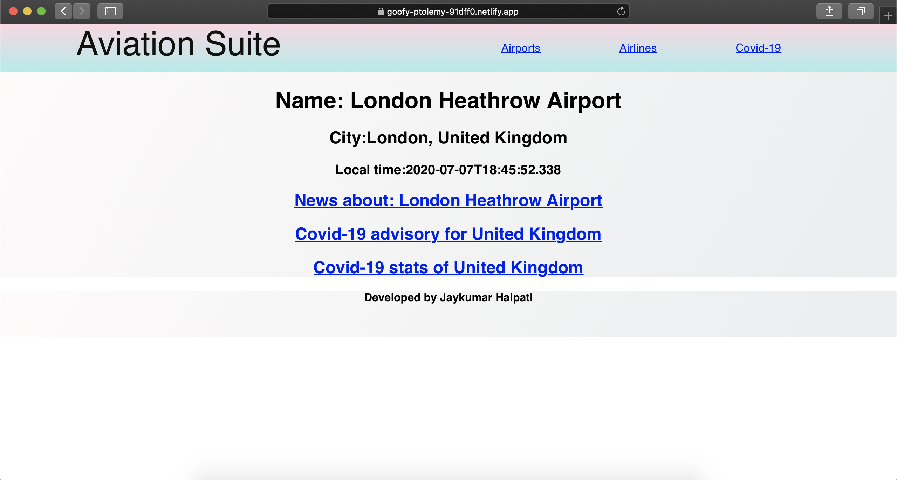

# Aviation Suite

## It was my Computing project during my 3rd year at university
## Nominated for [the Department of Computing Project Prize 2020](https://sites.gold.ac.uk/computing-project-prizes/jaykumar-halpati/)

Check it out at [Aviation Suite](https://goofy-ptolemy-91dff0.netlify.app/)

Aviation suite allows a user to retrieve information about airports and airlines along with latest news headlines related to that specific airport and airline

Additional features which displays a country’s travel advisory and Covid-19 stats were added due to the current pandemic. This application was developed using technologies such as ReactJS, JavaScript, HTML, CSS and implementation of various APIs(Application Programming Interface).

## Below are some screenshots of the web-app

